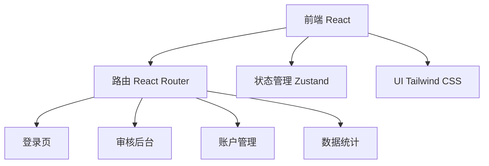
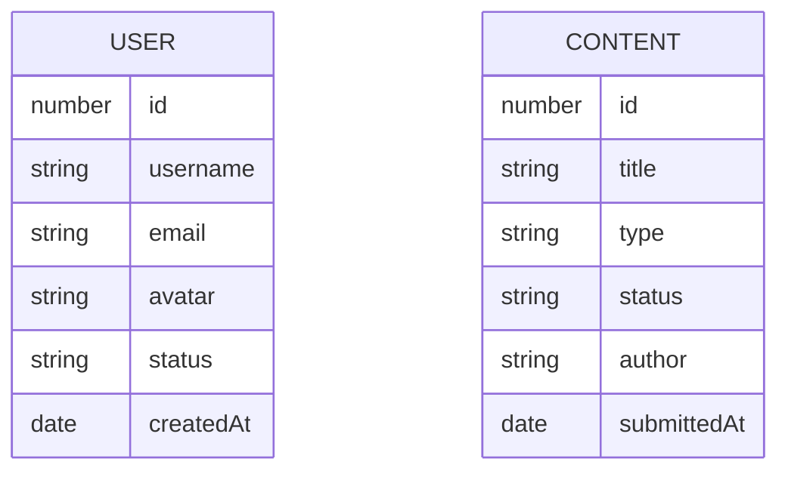

## 1. 架构设计

## 2. 技术描述
- 前端: React@18 + TypeScript + Tailwind CSS@3 + Vite
- 路由: React Router DOM
- 状态管理: Zustand
- 图标: Lucide React
- 初始化工具: vite-init

## 3. 路由定义
| 路由 | 用途 |
|-----|------|
| /login/user | 普通用户登录页 |
| /login/admin | 管理员登录页 |
| /dashboard | 数据统计 |
| /moderation | 审核后台 |
| /accounts | 账户管理 |

## 4. 数据模型

### 4.1 数据模型定义

### 4.2 模拟数据
通过 Zustand store 管理模拟数据，包含用户数据和待审核内容数据。
