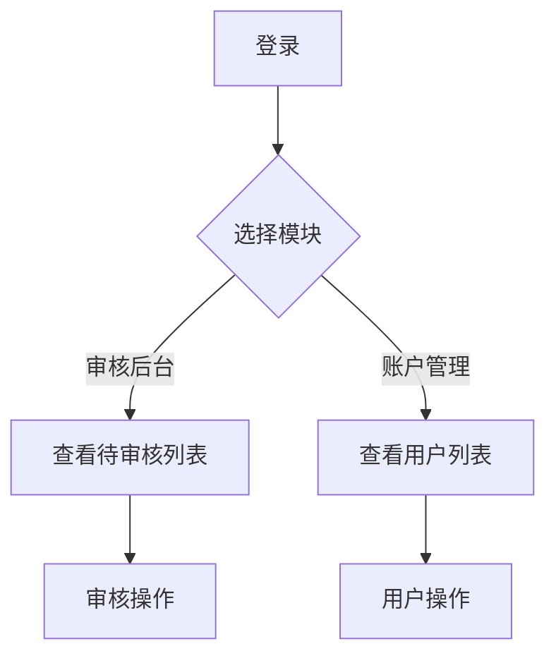

## 1. 产品概述
B站风格的内容审核后台和账户管理后台，为运营人员提供高效的内容审核、用户管理和数据统计功能。
- 主要目的：为视频平台内容管理和运营
- 目标用户：平台运营人员、审核专员、管理员

## 2. 核心功能

### 2.1 用户角色
| 角色 | 注册方式 | 核心权限 |
|------|----------|----------|
| 普通用户 | 自主注册 | 浏览内容、个人中心 |
| 超级管理员 | 后台创建 | 完整权限，用户管理、审核管理、数据统计 |
| 审核专员 | 后台创建 | 内容审核权限 |

### 2.2 功能模块
1. **普通用户登录页**：普通用户登录验证
2. **管理员登录页**：管理员/审核专员登录验证
3. **审核后台**：待审核列表、审核详情、审核操作
4. **账户管理**：用户列表、用户详情、用户操作
5. **数据统计**：平台数据概览

### 2.3 页面详情
| 页面名称 | 模块名称 | 功能描述 |
|---------|---------|---------|
| 普通用户登录页 | 登录表单 | 普通用户用户名密码登录、记住密码 |
| 管理员登录页 | 登录表单 | 管理员/审核专员用户名密码登录、记住密码 |
| 审核后台 | 待审核列表 | 视频/评论列表、筛选、搜索 |
| 审核后台 | 审核操作 | 通过、驳回、审核原因填写 |
| 账户管理 | 用户列表 | 用户信息展示、状态筛选、搜索 |
| 账户管理 | 用户操作 | 封禁/解封、查看详情、编辑信息 |
| 数据统计 | 数据概览 | 审核量、用户量、趋势图 |

## 3. 核心流程
管理员登录后台，进入审核后台或账户管理页面，查看待审核内容进行审核，或管理用户账户。

## 4. 用户界面设计
### 4.1 设计风格
- 主色调：B站标志性的粉色 (#FB7299) 和蓝色 (#00A1D6)
- 按钮风格：圆角矩形，轻微阴影
- 字体：现代sans-serif
- 布局风格：卡片式布局，侧边导航
- 图标：简洁线性图标

### 4.2 页面设计概览
| 页面名称 | 模块名称 | UI元素 |
|---------|---------|--------|
| 登录页 | 登录表单 | 渐变背景、卡片式登录框、粉色主题色 |
| 审核后台 | 待审核列表 | 表格布局、状态标签、操作按钮 |
| 账户管理 | 用户列表 | 头像展示、状态色标、操作列 |
| 数据统计 | 数据概览 | 卡片式统计、图表展示 |

### 4.3 响应式设计
桌面优先设计，支持中等屏幕自适应
